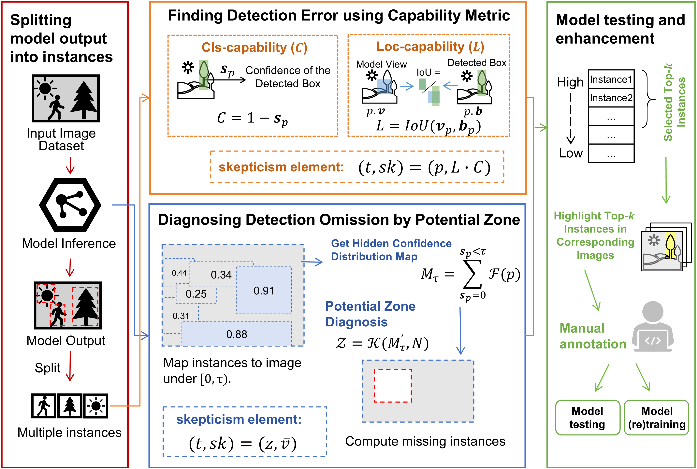
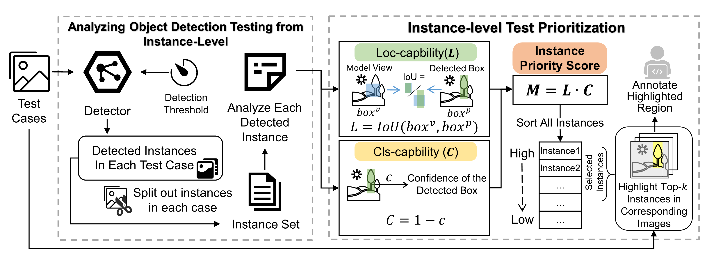
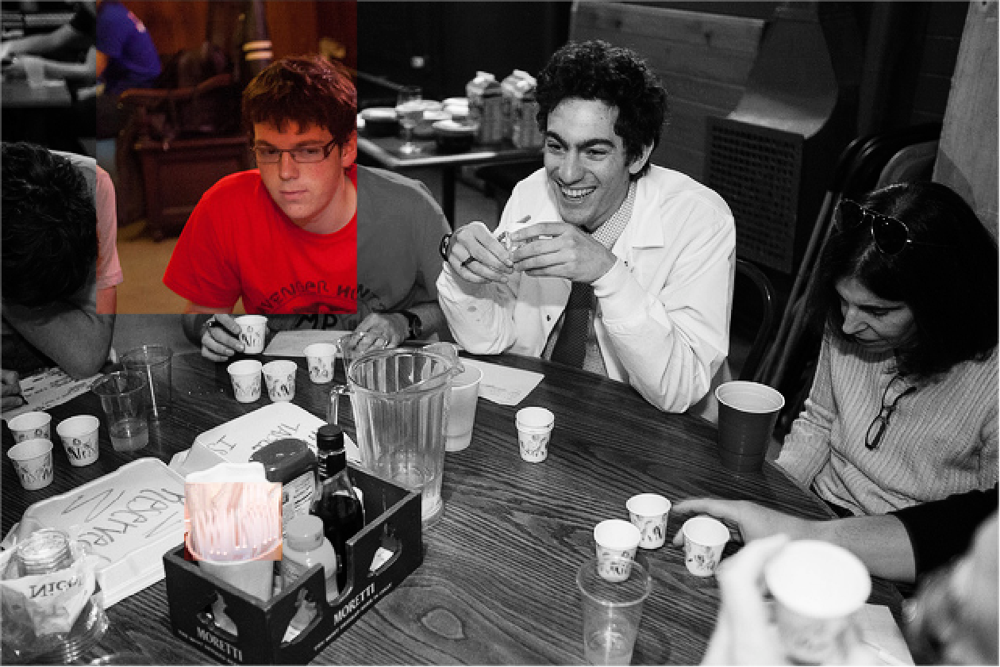
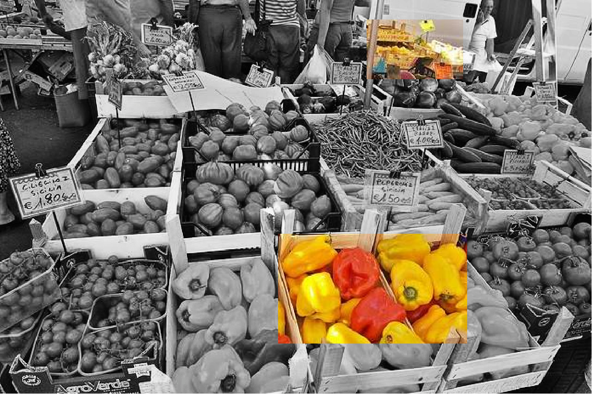

# DeepView

## Description
DeepView is available in two different versions:
### DeepView+
This repository is an implementation of the paper: **Seeing the Invisible: Test Prioritization for Object Detection System**

 

In this paper, we expand our previous work and propose a new prioritization method named DeepView+. This method is designed for object detection systems at the instance-level, which assists testers in identifying both detection errors and omissions within these systems. For detection error, DeepView+ assigns a skepticism score to each predicted bounding box based on classification and localization capability. Moreover, DeepView+ overcomes the shortcomings of all existing prioritization methods that only focus on the prediction results, and introduces a novel algorithm to assign skepticism score for potential detection omission zones in each input. By aggregating the scores of two types of model error, DeepView+ is capable of identifying false positives and false negatives simultaneously. We extensively evaluate the superiority and diversity of DeepView+ through 27 experimental configurations. The experimental results further demonstrate the necessity of finding false negative detection omissions, as well as the outstanding effectiveness of DeepView+ in prioritizing detection omissions.

### DeepView (old version)
This repository is also an implementation of the paper: **Prioritizing Testing Instances to Enhance the Robustness of
Object Detection Systems**

**DeepView** is an instance-level test prioritization tool for object detection models to reduce data annotation costs.

 

[//]: # (Object detection models have been widely deployed in military and life-related intelligent software systems. However, along with the outstanding success of object detection, it may exhibit abnormal behavior and lead to severe accidents and losses. During the development and evaluation process, training and evaluating an object detection model are computationally intensive, while preparing annotated tests requires extremely heavy manual labor. Therefore, reducing the annotation-budget of test data collection becomes a challenging and necessary task. Although many test prioritization approaches for DNN-based systems have been proposed, the large differences between classification and object detection make them difficult to be applied to the testing of object detection models.)

[//]: # ()
In this paper, we propose **DeepView**, a novel instance-level test prioritization tool for object detection models to reduce data annotation costs. **DeepView** is based on splitting object detection results into instances and calculating the capability of locating and classifying an instance, respectively. We further designed a test prioritization tool that enables testers to improve model performance by focusing on instances that may cause model errors from a large unlabeled dataset. To evaluate DeepView, we conduct an extensive empirical study on two kinds of object detection model architectures and two commonly used datasets. The experimental results show that **DeepView** outperforms existing test prioritization approaches regarding effectiveness and diversity. Also, we observe that using **DeepView** can effectively improve the accuracy and robustness of object detection models.

## Installation
`pip install -r requirements.txt`

## Experimental Results

The complete experimental results of DeepView+ are stored below:

**effectiveness**: `./exp_res/effectiveness`

**diversity**: `./exp_res/diversity`

**guidance**: `./exp_res/guidance`

## Usage
We prepared a complete demo running DeepView+ on the COCOval dataset mentioned in the paper. You can run this demo by executing:

`python demo.py`

Note: you should first download [coco2017val](https://cocodataset.org/#download) dataset in the correct folder

If you want to reproduce our experimental results:

+ You should first download our data&model via: https://pan.baidu.com/s/1PYpeFlzAIOPU1ATC7uRHAg 
extract code：`dvps`

## Output and Annotation
`deepview_result.json` is the output of **DeepView**, 
which is a prioritized set of instances that you can map 
top-k instances back to the original image according to your 
annotation budget and highlight them to provide to the annotator

The annotator only needs to focus on the highlighted 
areas and annotate them 

Some examples are shown below:

<table frame=void>	<!--用了
进行封装-->
	<tr>
        <td>

	<!--每个格子内是图片加标题-->
        		<!--高度设置-->
        	 	<!--换行-->
        		<!--标题1-->
        

</td>    
     	<td>

	<!--第二张图片-->
    			
    		 
    		 <!--标题1-->
        

</td>
        <td>

	<!--每个格子内是图片加标题-->
        		<!--高度设置-->
        	 	<!--换行-->
        		<!--标题1-->
        

</td> 
        <td>

	<!--每个格子内是图片加标题-->
        		<!--高度设置-->
        	 	<!--换行-->
        		<!--标题1-->
        

</td> 

</table>

You can modify the code in the `demo.py` to run **DeepView** on other datasets and models.
